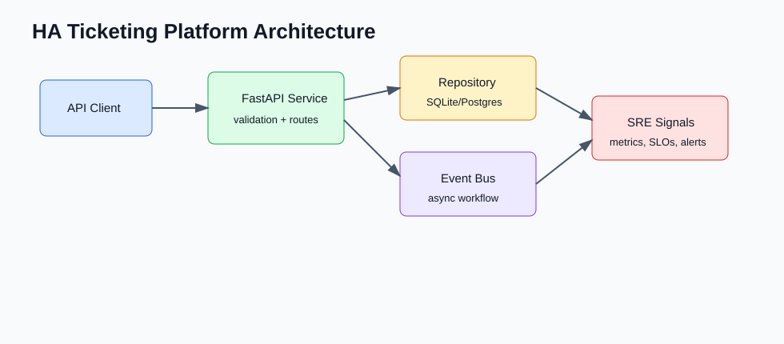
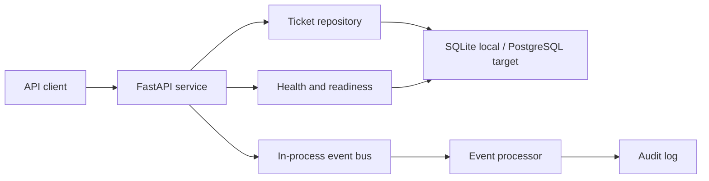

# HA Ticketing Platform

A small ticketing API used to exercise reliability patterns around persistence, async events, health checks, and local observability.

The default setup uses SQLite and an in-memory event queue so the app can be run quickly. Docker Compose switches the same code path to Postgres, Redis, Prometheus, Grafana, and an OpenTelemetry collector.

## Features

- ticket create, assign, transition, comment, and list flows
- SQLite by default; Postgres when `DATABASE_URL` is set
- in-memory event bus by default; Redis when `REDIS_URL` is set
- `/health`, `/ready`, `/metrics`, and SLA scan endpoints
- Dockerfile, Kubernetes manifests, and Docker Compose local stack
- small scripts for demo traffic, load smoke, and event contract checks

## Local Quickstart

```bash
python3 -m venv .venv
source .venv/bin/activate
pip install -r requirements.txt
uvicorn ticketing.main:app --reload --app-dir src
```

Useful URLs:

- API docs: `http://127.0.0.1:8000/docs`
- Health: `http://127.0.0.1:8000/health`
- Metrics: `http://127.0.0.1:8000/metrics`

## Common Commands

```bash
make test
make demo
make load-smoke
```

Without `make`:

```bash
PYTHONPATH=src python3 -m unittest discover -s tests
python3 scripts/demo_flow.py
python3 scripts/load_smoke.py
curl http://127.0.0.1:8000/metrics
```



## Docker Compose

```bash
docker compose up --build
```

This starts the API with Postgres persistence, Redis-backed events, Redpanda as the Kafka-compatible broker target, Prometheus, Grafana, and an OpenTelemetry collector.

For shared environments, copy `.env.example` to `.env` and set your own local values. `.env` is ignored by git.

Stack URLs:

- API: `http://127.0.0.1:8000/docs`
- Prometheus: `http://127.0.0.1:9090`
- Grafana: `http://127.0.0.1:3000`

Runtime switches:

- `DATABASE_URL=postgresql://...` enables Postgres; otherwise SQLite is used.
- `REDIS_URL=redis://...` enables Redis-backed event storage; otherwise the in-process bus is used.
- `OTEL_EXPORTER_OTLP_ENDPOINT=http://otel-collector:4318` enables OpenTelemetry traces.

## Architecture



## Project Layout

- `src/ticketing/` - application code
- `tests/` - unit tests for core behavior
- `scripts/` - load and failure simulation helpers
- `infra/k8s/` - Kubernetes deployment manifests
- `infra/terraform/` - cloud module skeletons
- `docs/` - design, runbook, SLOs, failure modes

## Notes

This is not meant to be a full ITSM product. It keeps the domain small so the reliability pieces are easy to inspect. The Redpanda service is included to document the production event-stream target; the current app uses Redis for the local event queue.
